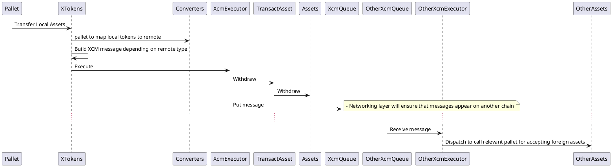

# Overview

Runs transfers from some Composable based parachain to Composable parachain. And other parachains integrations.

We do not use direct XCM messages as these are alfa quality.
So all messages go via Realay. Using Direct XCM messaging open channels amid chains with no hops.

We do not use `Teleport` messages as it is considered unsafe.

## Flow

### Setup

- Relay must to be added with parachains which will communicate
- Each parachain must add other parachain into `ParachainSystem` to allow requests from another chain
- Each parachain setups execution prices and filters to secure XCMP messaging
- Each parachain must add mapping for currency it wants to send to other parachain

### Transfer currency

Amounts are defined as next:
```rust
// next tells 1 networks up (jump to relay, find chain with ID, than encode para native asset),
let asset_id = AssetId::Concrete(MultiLocation::new(1, X2(Parachain(PICASSO_PARA_ID), GeneralKey(СurrencyId::PICA.encode())));
// here we encode amount of 42 tokens to be manipulated
let amount_and_asset_id = MultiAsset{ fun : Fungible(42), id: asset_id};
```

Transfer currency is based on sending some named messages interpreted on each chain, but always ends with `dispatch` calls on target chain.  It is possible to send a message and ask send a response about success/fail operation, but that happens not in same block. For selling out things on DEX, will add `Transact` instruction to appreciate pallet */




## Readings


### How to setup XCMP

- [Polkadot XCM Cross-Chain Asset Transfer Demo](https://medium.com/oak-blockchain/polkadot-xcm-cross-chain-asset-transfer-demo-53aa9a2e97a7)
- https://medium.com/oak-blockchain/tutorial-polkadot-cross-chain-message-passing-xcmp-demo-with-ping-pallet-f53397158ab4

### Format of messages

- https://medium.com/polkadot-network/xcm-part-ii-versioning-and-compatibility-b313fc257b83
- https://medium.com/polkadot-network/xcm-part-iii-execution-and-error-management-ceb8155dd166
- [xcmp format]:https://github.com/paritytech/xcm-format/blob/master/README.md
- https://research.web3.foundation/en/latest/polkadot/XCMP/index.html
- https://medium.com/polkadot-network/xcm-the-cross-consensus-message-format-3b77b1373392


### XCMP desing

- https://www.youtube.com/watch?v=wrA9vlPjVPE
- https://research.web3.foundation/en/latest/polkadot/XCMP/Opening_closing%20XCMP%20Channel.html

### Generic context

- https://wiki.polkadot.network/docs/learn-bridges
- https://wiki.polkadot.network/docs/learn-parachains
- https://polkadot.network/Polkadot-lightpaper.pdf
- https://wiki.polkadot.network/docs/learn-crosschain
- https://medium.com/web3foundation/polkadots-messaging-scheme-b1ec560908b7


## How to run

```shell
RUST_LOG=trace,parity-db=error,trie=error,runtime=trace,substrate-relay=trace,bridge=trace cargo test   --features develop -- --nocapture --test-threads=1
```